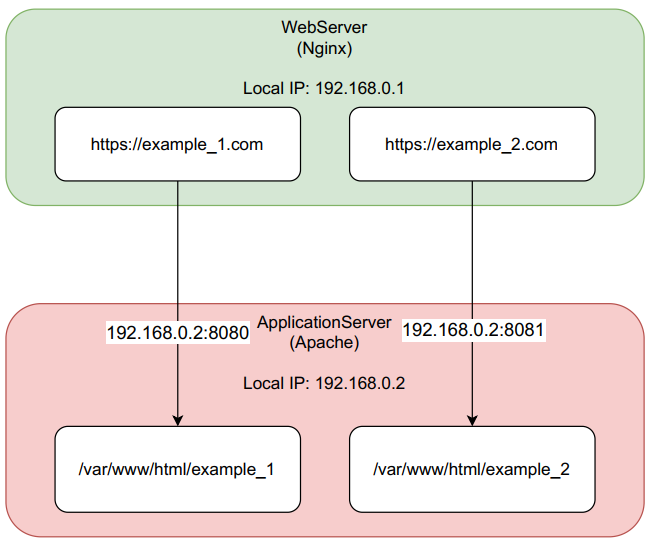

### WebServer

- リバースプロキシとして動作
- 2種類のドメインを設定する
- ドメイン毎に証明書を設定し、常時暗号化するよう設定する
- nginxのバーチャルホストでドメイン名毎にApplicationServerへの接続先を振り分ける

### ApplicationServer

- WebServerとローカルIPで接続し、WebServerからの接続しか受け付けないよう設定
- ポートを2つ開放し、バーチャルホストの設定でそれぞれ表示するページを分ける